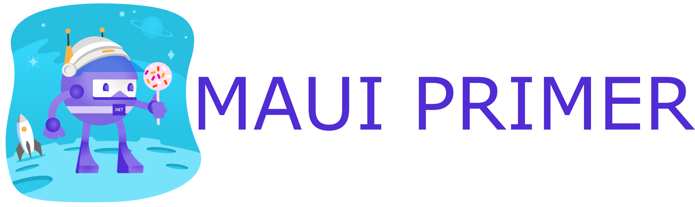

  

---

## 📝 Table of Contents

- [Motivation](#motivation)
- [Study Guide](#study-guide)
- [Contributing](#contributing)
- [Under development](#under-development)
- [Contact Info](#contact-info)
- [License](#license)

# 🙌 Motivation 

> Learn how to build cross platform applications.

.NET MAUI is a cross platform framework for building mobile and desktop applications using C# and XAML. Goal is to deliver a better, streamlined and free of cost learning experience to developers.

This is a community guide for developers interested in learning and developing cross platform app development using MAUI. This repo is an **organized collection** of resources to help you learn MAUI and build applications.

### Learn from the open source community

This is an open source project. The goal is to continually update the content.

[Contributions](#🤝contributing) are welcome!

# 📗 Study Guide
- ### Prerequisites
	- Install .NET CLI 
	- Install Visual Studio 2022
	- Install Visual Studio Code
- ### General Development Skills
	- GIT - Version Control (VSTS, GitHub, GitLab)
	- HTTP/HTTPS protocol
	- Learn to find solutions
	- Learn the basics of CI/CD
	- Application Settings & Configurations
	- Get an overview of Data Structures and Algorithms 
	- Get familiar with .NET CLI
- ### C# Fundamentals
	- Learn the basics of C# 10/ C# 11
	- Learn .NET 6/ .NET 7
	- Learn LINQ
	- Object-relational mapping (ORM)
		- Entity framework Core 
			- Learn the basics of Entity Framework Core
			- Code first and Migrations
			- Change Tracker API
			- Lazy Loading, Eager Loading, Explicit Loading
			- Table per Type (TPT)
			- Table per Hirerachy (TPH)
		- NHibernate
- ### XAML
	- Learn the basics of data bindings
	- Triggers and behaviors
	- Effects
	- Controls
	- Accessibility
	- Creating Custom Reusable Controls
		- Custom Handlers
		- Content View
		- Template View
		- Control Templates
		- Graphics View
		- Custom Renderers
- ### Model-View-View-Model (MVVM) 
	- Fundamentals
		- Dependency Injection
			- DI Containers
				- Microsoft.Extensions.DependencyInjection
				- Autofac 
			- Life cycles
				- Scoped
				- Transient
				- Singleton
		- Navigation
		- Validation
		- Commands
		- Converters
	- Frameworks
		- .NET Community MVVM Toolkit
		- FreshMVVM
		- Prism
		- MVVMCross
		- ReactiveUI
- ### MAUI Fundamentals
	- Understanding the MAUI Platform
	- Understanding MAUI single project structure
	- Profiling MAUI Apps using .NET trace and Perf view
	- Working with layouts
	- Managing Resources, Styles and Themes in MAUI
	- Understand the application lifecycle
	- Working with File System (Platform, Portable)
	- Applying custom Linker Configuration
	- Consuming RESTful Services
	- Understanding and Handeling Permissions in MAUI
	- Sharing Code & Controls Strategies (across multiple projects)
 
	- iOS
		- App Delegate, View, ViewController, Protocol
		- Design a UI in iOS: using Storyboards, NIBs, Code
		- User interface controls in iOS
	- Android
		- Understand the Android Application Manifest
	- Understanding and adopting the MAUI Program Class (MauiProgram.cs)

- Good to Know Libraries
	- MAUI Community Toolkit
	- MAUI Community Toolkit Markup
- ### Data Access
	- Plugins
		- Settings Plugin
		- Akavache
	- Databases
		- SQLite
		- Realm
		- LiteDB
		- Cloud databases
			- Amazon DynamoDB
			- Firebase Realtime Database
	- Saas
		- Azure mobile apps
- ### Authentication
	- Social Authentication
		- Facebook
		- Instagram
		- Google
		- Twitter
		- Microsoft
		- LinkedIn
	- Biometrics Authentication
		- Android
			- Fingerprint Authentication
			- Face Authentication
		- iOS
			- Touch ID
			- Face ID
	- Authentication with AWS
	- Authentication with Azure
	- Web Authentication  in MAUI
- ### API Clients
	- REST
		- HttpClient
		- Polly
		- Refit
	- GraphQL
		- GraphQL for .NET
- ### Media
	- Microsoft.Maui.Graphics
	- SkiaSharp
		- Lottie
	- Media Picker MAUI
- ### Real-Time Communication
	- SignalR
- ### Testing
	- Unit Testing
		- Frameworks
			- NUnit
			- xUnit
	- Behavior Testing
		- Frameworks
			- SpecFlow
	- UI Testing
		- Xamarin.UITest 
		- AWS Device Farm
		- Appium (Android and iOS)
		- XCUITest (iOS)
	- Mocking
		- Frameworks
			- Moq
- ### Logging
	- NLog
	- Android Debug Log
- ### Crash Reporting and Analytics
	- Google Analytics
	- Firebase Analytics
	- App Center Analytics
	- App Center Crashes
	- Amazon Mobile Analytics
- ### Payment Gateway
	- In-App Purchase
	- In-App Billing
	- Apple Pay in Xamarin.iOS
	- Stripe
	- Braintree
	- WePay
- ### Artificial Intelligence (AI)
	- Machine Learning
		- CoreML
		- ML Kit
		- Google Cloud APIs
	- Augmented Reality
		- Android
			- ARCore
		- iOS
			- ARKit
	- Optical Character Recognition (OCR)
		- ML Kit for Firebase
		- Amazon Rekognition
		- Microsoft Computer Vision
		- Google Cloud Vision
		- CoreML
		- Tesseract
		- SwiftOCR
	- Speech recognition
		- Watson Assistant v2
		- Microsoft Bot Framework
	- Cognitive services
		- Azure Cognitive Service
- ### Push Notifications
	- Remote
		- Azure Notification Hubs
		- Firebase Cloud Messaging
		- Amazon Web Services
	- Local
- ### Advertising
	- AdMob
	- Google Admob
	- Microsoft Advertising SDK
- ### App Distribution
	- iOS
		- Preparing for release (distribution certificate, provision profile)
		- App Store
		- GetJar
		- Appland
	- Android
		- Preparing for release (sign, zipalign)
		- Google Play
		- Amazon App Store
		- SlideMe
- ### Advanced
	- iOS
		- Binding Objective-C libraries
	- Android
		- Binding a Java library on Xamarin
	- Cross-Platform
		- Localization
		- Deep Linking
		- Messaging Center
		- Working with Maps
		- Implementing Background tasks
		- Performance
		- Using Calendar and Reminders
- ### Tools
	- Charles
	- TestFlight
	- Postman
- ### Expert
	- iOS
		- Keychain ACL
	- Android
		- JobScheduler
	- Cross-Platform
		- Connectivity with NFC, Bluetooth
		- Social sharing
- ### Game Engine
	- CocosSharp
	- MonoGame
	- UrhoSharp
- ### SOLID
	- Single Responsibility Priniciple ( SRP )
	- Open-Closed Principle (OCP)
	- Liskov Substitution Principle (LSP)
	- Interface Segregation Principle (ISP)
	- Dependency Inversion Principle (DIP)
- ### Design Patterns
	- Abstract Factory
	- Factory Method
	- Command
	- Decorator
	- Strategy
	- Observer
	- Builder
	- Singleton
	- Facade
	- Mediator

# 🤝Contributing

> Learn from the community.

Feel free to submit pull requests to help:

* Fix errors
* Add content for existing sections
* Improve sections
* Add new sections

Content that needs some polishing will be placed [under development](#⚙️under-development).

Review the [Contributing Guidelines](CONTRIBUTING.md).

# ⚙️Under development

Interested in adding a section or helping complete one in-progress?  [Contribute](#contributing)!

- [Study Guide](#📗-study-guide)

# 📱Contact info

Feel free to contact me to discuss any issues, questions, or comments.

My contact info can be found on my [GitHub page](https://github.com/behl1anmol).

# 🪪License

I am providing code and resources in this repository to you under an open source license. You can view the complete terms in [License](LICENSE.md) page

    Copyright 2023 Anmol Behl

    Creative Commons Attribution 4.0 International License (CC BY 4.0)

    http://creativecommons.org/licenses/by/4.0/
